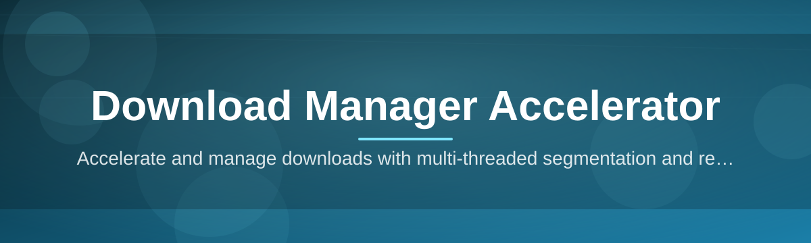

# dm-booster 🚀⚡

  

*Your downloads, minus the waiting around.*

  

## 📦 Overview

dm-booster is a lightweight Windows companion that sits between your browser and your hard drive, squeezing every last drop of throughput out of your connection. Instead of letting a single-threaded download crawl along at a fraction of your bandwidth, it splits files into smart segments, pulls them in parallel, and stitches them back together without you ever noticing the machinery underneath. It's a download manager accelerator built for people who are tired of watching progress bars move at the speed of continental drift.

This project exists because most built-in browser downloaders are stuck in 2010 — single connection, no resume logic worth trusting, and zero awareness of your actual network capacity. dm-booster was built solo, shipped fast, and iterated on based on what actually breaks in the real world: flaky Wi-Fi, huge ISO files, big game patches, and datasets that time out halfway through. If you've ever rage-quit a download at 94%, this tool is for you.

Who's it for? Students pulling large lecture archives, developers grabbing SDKs and container images, gamers downloading patches the size of a small OS, and anyone on a metered or unstable connection who needs resumable, multi-threaded downloads that actually resume. No account required, no telemetry theater — just a focused download accelerator that does one job extremely well.

---

## 🧩 What's Under The Hood

| Capability | Why It Matters |
|---|---|
| **Segmented Pulling** | Splits large files into multiple chunks and downloads them concurrently, so you're not limited by one slow connection thread. |
| **Adaptive Threading** | Reads live network conditions and adjusts thread count on the fly instead of using a fixed, guessed number. |
| **Resume From Anywhere** | Power outage, closed laptop lid, dead Wi-Fi — pick up exactly where you left off, byte for byte. |
| **Browser Hooking** | Detects downloads started in Chrome, Edge, or Firefox and offers to accelerate them automatically. |
| **Queue Scheduling** | Line up dozens of downloads and let dm-booster manage bandwidth allocation between them intelligently. |
| **Speed Throttling** | Cap usage during work hours so your video calls don't choke while a big file grinds away in the background. |
| **Integrity Verification** | Automatic checksum comparison post-download so you know the file isn't silently corrupted. |
| **Zero-Install Portable Mode** | Run it straight off a USB stick or a folder — no system-wide install footprint required. |

> [!TIP]
> Drag-and-drop a direct link straight onto the dm-booster window to start a segmented download instantly — no copy-paste dance needed.

---

## 🏁 Getting Rolling

1. **Visit the landing page** using the download button above.

2. **Grab the latest build** — it's a single portable executable, no installer wizard nonsense.

3. **Run it** — Windows might flag it as unrecognized on first launch since it's a fast-moving indie project; click through and it opens instantly.

4. **Paste a link or drop a file URL** into the queue and watch the segments light up.

> [!NOTE]
> No sign-up, no license key, no background service installed. It runs when you run it, and closes when you close it.

---

## 🖥️ System Requirements

| Requirement | Details |
|---|---|
| **OS** | Windows 10 or Windows 11 (64-bit) |
| **Dependencies** | None — fully standalone, self-contained executable |
| **Disk Space** | Under 50 MB for the app itself |
| **RAM** | 200 MB typical during active multi-segment downloads |
| **Network** | Any — the accelerator adapts to slow, fast, or unstable connections |

---

## ⚙️ How It Works

The whole pipeline is deliberately simple on the surface even though the segmentation logic underneath is doing real work:

1. You submit a URL or dm-booster intercepts a browser download.

2. It probes the server to check if range-requests (partial content) are supported.

3. If supported, the file is divided into segments and pulled in parallel connections.

4. Segments are verified and reassembled into the final file in correct order.

5. You get a completed, integrity-checked file — faster than a single-stream pull.

> [!IMPORTANT]
> If a server doesn't support range-requests, dm-booster automatically falls back to a single reliable stream — it never breaks the download just to chase speed.

---

## 🛟 Troubleshooting

<strong>My download isn't going any faster than my browser's default.</strong>

Some servers throttle per-IP regardless of connection count, or they don't support partial content requests at all. In those cases, segmentation has nothing to split — speed will match a normal single-thread download.

<strong>Windows SmartScreen is warning me before I open it.</strong>

This is expected for small independent tools without a paid code-signing certificate. The binary is unmodified and safe to run — click "More info" then "Run anyway."

<strong>A paused download won't resume properly.</strong>

Check that the source file hasn't been replaced or removed on the server side. If the remote file changed since you started, resume will fail integrity checks and restart the segment.

<strong>Can I limit how much bandwidth dm-booster uses?</strong>

Yes — open Settings and set a manual speed cap, or enable the automatic "Quiet Hours" throttle for scheduled bandwidth limiting.

<strong>Does it work with password-protected or authenticated links?</strong>

Direct links with token-based authentication in the URL work fine. Fully session-based downloads behind a login wall may need the browser-hook mode instead of a raw pasted link.

---

## 🎨 UI & Experience

dm-booster keeps its interface minimal because the queue is the star of the show, not chrome around it.

- `Ctrl+N` — add a new download

- `Ctrl+Shift+P` — pause all active segments

- `Ctrl+Shift+R` — resume everything queued

- `Delete` — remove selected entry from the queue

- `Ctrl+,` — open Settings panel

Themes ship in **Light**, **Dark**, and **Midnight Amber** — switchable instantly from the tray icon menu without restarting the app. Settings persist locally in a small config file next to the executable, so portable installs stay portable.

  

---

## 🤝 Contributing & Community

This started as a solo project and it's still driven that way — fast decisions, fast fixes, no committee meetings. That said, issues, feature requests, and pull requests are genuinely welcome.

> [!TIP]
> Before opening an issue, check if it's already a known quirk in the changelog below — a lot of edge cases get patched within days.

If you want to contribute code, keep PRs focused and small; a tight, reviewable diff gets merged a lot faster than a sprawling one.

---

## 📜 License

Released under the [MIT License](LICENSE), 2026. Use it, fork it, build on it.

---

## ⚠️ Disclaimer

dm-booster is provided as-is, without warranty of any kind. It accelerates downloads by managing connections more efficiently — it does not, and cannot, alter the content, licensing, or legality of what you choose to download. You're responsible for how you use it.

---

## 🗒️ Changelog

### v2026.3
- Added Midnight Amber theme
- Fixed a resume bug affecting files over 8GB
- Improved server probing speed for slow-responding hosts

### v2026.2
- Introduced Quiet Hours bandwidth throttling
- Browser hook now supports Firefox in addition to Chrome/Edge
- Minor UI polish on the queue panel

### v2026.1
- Initial 2026 rebuild — new segmentation engine
- Portable mode added, no installer required
- Checksum verification enabled by default

